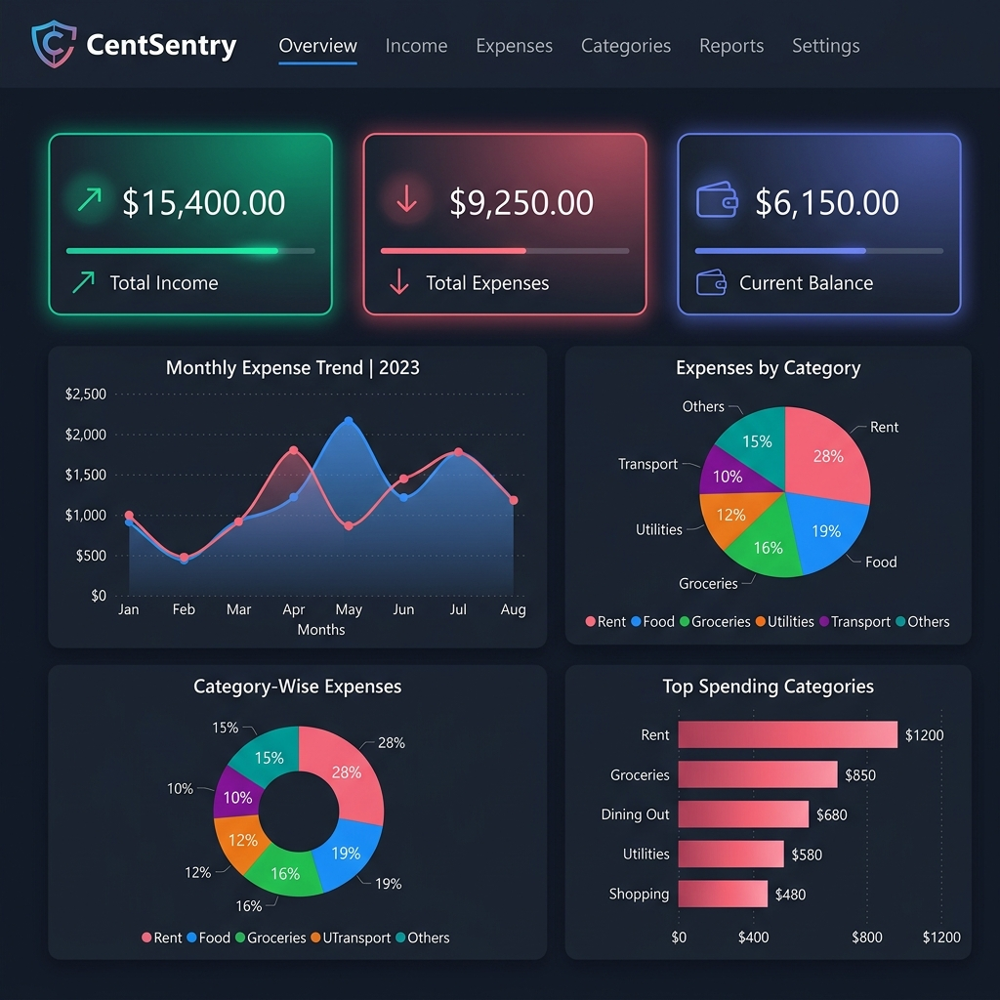

# 💰 CentSentry – Personal Expense Tracker

A modern full-stack expense management platform that helps users track income, monitor expenses, manage budgets, and gain financial insights through interactive analytics dashboards.

---

## 📌 Overview

CentSentry is a full-stack web application designed to simplify personal finance management.

Users can securely manage their income and expenses, set monthly budgets, visualize spending patterns, and receive smart insights about their financial habits.

The application features authentication, analytics dashboards, CSV export functionality, responsive design, and real-time financial tracking.

---

## ✨ Features

### 🔐 Authentication & Security

* User Registration and Login
* JWT-based Authentication
* Protected Routes
* Secure Password Hashing
* Session Persistence

### 💵 Income Management

* Add Income Records
* Edit Income Entries
* Delete Income Entries
* Search and Filter Income History

### 💸 Expense Management

* Add Expenses
* Edit Expenses
* Delete Expenses
* Category-based Organization
* Search and Date Filtering
* Expense History Tracking

### 📊 Analytics Dashboard

* Category-wise Expense Distribution
* Monthly Spending Trends
* Income vs Expense Analysis
* Interactive Charts using Recharts
* Financial Performance Monitoring

### 🎯 Budget Tracking

* Set Monthly Budget
* Budget Utilization Monitoring
* Remaining Budget Calculation
* Overspending Alerts
* Progress Indicators

### 📈 Smart Financial Insights

* Month-over-Month Spending Analysis
* Category Breakdown Reports
* Budget Status Recommendations
* Spending Pattern Identification

### 📂 Data Export

* Export Transactions to CSV
* Easy Financial Record Management

### 🌙 User Experience

* Responsive Design
* Dark Mode Support
* Modern Dashboard UI
* Mobile-Friendly Layout

---

## 🛠️ Tech Stack

### Frontend

* React
* TypeScript
* Tailwind CSS
* React Router
* Axios
* Recharts

### Backend

* FastAPI
* Python
* SQLAlchemy
* JWT Authentication

### Database

* PostgreSQL

### Deployment

* Vercel (Frontend)
* Render (Backend)

---

## 🏗️ System Architecture

```text
Frontend (React + TypeScript)
            │
            ▼
      FastAPI Backend
            │
 ┌──────────┴──────────┐
 ▼                     ▼
PostgreSQL        JWT Auth
(Database)       Security Layer
```

## 📊 Core Modules

### Dashboard

* Financial Overview Cards
* Recent Transactions
* Budget Monitoring
* Smart Insights

### Expenses

* CRUD Operations
* Category Management
* Filtering & Search

### Income

* CRUD Operations
* Source Tracking
* Income Analytics

### Analytics

* Pie Charts
* Bar Charts
* Comparative Analysis

### Profile

* User Settings
* Password Updates
* Account Management

---

## 🗄️ Database Design

### Users

* id
* username
* email
* password_hash
* created_at

### Income

* id
* user_id
* source
* amount
* date
* notes

### Expense

* id
* user_id
* title
* amount
* category
* date
* notes

### Budget

* id
* user_id
* monthly_budget

---

## ⚙️ Installation

### Clone Repository

```bash
git clone https://github.com/your-username/centsentry-expense-tracker.git
cd centsentry-expense-tracker
```

### Backend Setup

```bash
cd backend

python -m venv venv

# Windows
venv\Scripts\activate

pip install -r requirements.txt

uvicorn app.main:app --reload
```

Backend runs on:

```text
http://localhost:8000
```

---

### Frontend Setup

```bash
cd frontend

npm install

npm run dev
```

Frontend runs on:

```text
http://localhost:5173
```

---

## 🔑 Environment Variables

Create a `.env` file inside the backend folder:

```env
DATABASE_URL=your_database_url
SECRET_KEY=your_secret_key
ACCESS_TOKEN_EXPIRE_MINUTES=60
```

---

## 📊 Power BI Dashboard Integration

CentSentry now includes built-in support for **Power BI Desktop**, allowing you to create rich, interactive business intelligence reports from your personal financial data.

### 🖼️ Power BI Dashboard Preview


### 📥 1. Exporting Your Transaction Data
1. Navigate to the main **Dashboard** in CentSentry.
2. Click the **Export CSV** button in the top-right header panel.
3. This downloads a combined transactions CSV (`centsentry_transactions_YYYY-MM-DD.csv`) containing:
   * **Date**: Transaction timestamp
   * **Category**: Expense category (e.g. Food, Bills) or Income source (e.g. Salary, Freelance)
   * **Amount**: Value of the transaction
   * **Transaction Type**: `Income` or `Expense`
   * **Payment Method**: Automatically resolved payment channel (Credit Card, Debit Card, Cash, UPI, Bank Transfer)
   * **Description**: Detailed title and transaction notes

### 🔌 2. Importing Data into Power BI
1. Open **Power BI Desktop**.
2. Click on **Get Data** > **Text/CSV**.
3. Select the downloaded `centsentry_transactions_*.csv` file and click **Load**.
4. Double-check that column data types are resolved correctly:
   * `Date` as **Date**
   * `Amount` as **Decimal Number** (Formatted as Currency)
   * `Category`, `Transaction Type`, `Payment Method`, `Description` as **Text**

### 🧮 3. Creating DAX Measures
To display core metrics on your dashboard, create the following DAX measures:

* **Total Income**:
  ```dax
  Total Income = CALCULATE(SUM('centsentry_transactions'[Amount]), 'centsentry_transactions'[Transaction Type] = "Income")
  ```
* **Total Expenses**:
  ```dax
  Total Expenses = CALCULATE(SUM('centsentry_transactions'[Amount]), 'centsentry_transactions'[Transaction Type] = "Expense")
  ```
* **Current Balance**:
  ```dax
  Current Balance = [Total Income] - [Total Expenses]
  ```

### 📈 4. Building the Dashboard Visuals
Create a new report canvas and add the following visuals:
1. **KPI Cards**:
   * Add three **Card** visuals and drag the `Total Income`, `Total Expenses`, and `Current Balance` measures into their respective fields.
2. **Monthly Expense Trend**:
   * Add an **Area Chart** or **Line Chart**.
   * Drag `Date` (grouped by Month) to the **X-axis**.
   * Drag the `Total Expenses` measure (or `Amount` filtered by `Transaction Type = Expense`) to the **Y-axis**.
3. **Category-wise Expense distribution**:
   * Add a **Pie Chart** or **Donut Chart**.
   * Drag `Category` to the **Legend** and `Amount` to the **Values**.
   * Filter the visual so `Transaction Type` is `Expense`.
4. **Top Spending Categories**:
   * Add a **Clustered Bar Chart** (Horizontal).
   * Drag `Category` to the **Y-axis** and `Amount` to the **X-axis**.
   * Filter the visual so `Transaction Type` is `Expense` and sort descending.

---

## 📸 Screenshots

### Dashboard


### Analytics Dashboard


---

## 🎯 Key Highlights

* Full-Stack Development
* RESTful API Architecture
* JWT Authentication
* PostgreSQL Database Design
* Interactive Data Visualization
* Responsive UI/UX
* Production-Ready Structure
* Deployment Ready

---

## 🚀 Future Enhancements

* Email Notifications
* Recurring Transactions
* AI-Powered Spending Recommendations
* Multi-Currency Support
* Expense Forecasting
* Mobile Application
* OCR Receipt Scanning

---

## 👩‍💻 Author

**Meenal**

B.Tech CSE (AI) | Full-Stack Developer | AI/ML Enthusiast

GitHub: https://github.com/Meenal01-lang

---

⭐ If you found this project useful, consider giving it a star.

